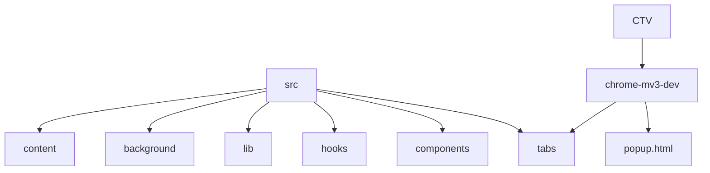

# Custom Table Viewer
## 🗂️ Description

The Custom Table Viewer is a Chrome extension designed to extract and visualize table data from web pages. It provides a user-friendly interface for users to view and interact with table data in a custom format. This project is ideal for developers and users who need to work with table data on a daily basis.

The extension uses a combination of content scripts, background scripts, and popup UI to extract table data from web pages and display it in a customizable format. With features like data visualization, conflict detection, and vacant day highlighting, the Custom Table Viewer is a powerful tool for anyone working with table data.

## ✨ Key Features

* **Table Data Extraction**: Extract table data from web pages using content scripts
* **Data Visualization**: Visualize table data in a custom format using FullCalendar library
* **Conflict Detection**: Detect conflicts and vacant days in the table data
* **Customizable**: Customize the appearance and behavior of the extension using various options
* **User-Friendly Interface**: User-friendly popup UI for easy interaction with table data

## 🗂️ Folder Structure

## 🛠️ Tech Stack

## ⚙️ Setup Instructions

To run the project locally, follow these steps:

* Git clone the repository: `https://github.com/pablojabb/CustomTableViewer.git`
* Install dependencies: `npm install`
* Start the development server: `npm run dev`
* Load the extension in Chrome: Go to `chrome://extensions/`, enable developer mode, and click "Load unpacked". Select the `CTV/chrome-mv3-dev` folder.

## 🤖 GitHub Actions

The project uses a GitHub Actions workflow to submit the extension to the Chrome Web Store. The workflow is defined in `.github/workflows/submit.yml`.

## 📦 Files and Directories

The project consists of the following files and directories:

* `postcss.config.js`: PostCSS configuration file
* `src/lib/utils.ts`: Utility file for merging class names
* `tsconfig.json`: TypeScript configuration file
* `.gitignore`: Git ignore file
* `CTV/chrome-mv3-dev`: Chrome extension files
* `src/background`: Background script
* `src/tabs`: Tab components
* `src/components`: React components
* `src/hooks`: Custom React hooks
* `src/content.ts`: Content script

## 📝 Code Organization

The code is organized into the following sections:

* `src/background`: Background script
* `src/tabs`: Tab components
* `src/components`: React components
* `src/hooks`: Custom React hooks
* `src/lib`: Utility files
* `CTV/chrome-mv3-dev`: Chrome extension files

  

<h3>Ant_Jumaya</h3>

sUPP

 

  <a href="https://gitfull.vercel.app">Made by GitFull</a>

    