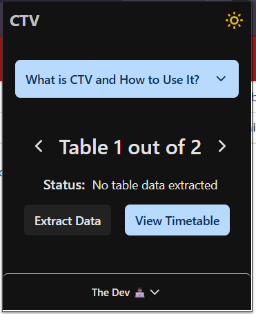

# CTV (Custom Table Viewer)

## Description

CTV is a browser extension designed to help students instantly visualize their schedules by extracting table data from the university’s system (Pre-Registration & Schedule Pages) and transforming it into a well-structured timetable. It automatically detects conflicts, highlights overlapping time slots, and presents the schedule in a clearer format. This removes the hassle of manually checking for conflicts, allowing students to resolve issues quickly and plan their time better—without long waiting times or unnecessary stress.

## Installation & Setup

### Download

[Download CTV Extension](https://github.com/pablojabb/CustomTableViewer/releases/tag/v1.2.0)

### Installation Guide

1. **Download the extension files** from the link above.
2. **Extract the ZIP file (if in .ZIP format)** to a folder on your computer.
3. **Open Chrome and go to** `chrome://extensions/`.
4. **Enable Developer mode** (top-right corner).
5. **Click "Load unpacked"** and select the extracted folder.
6. The extension should now be installed and ready to use.

### Video Guide

[How To Install Unpacked Extensions In Google Chrome - Full Guide](https://youtu.be/NH5CPm9pyts?si=mrQzDJGgTOjDVLN3)

### Preview

## Reporting Issues, Bugs, or Problems

Encountered a problem? Let me know!

📧 **Email:** jumayaanthony@gmail.com

📂 **Create an issue on this repository**

1. Go to the **Issues** tab in the repository.
2. Click **New Issue**.
3. Provide a descriptive title and details.
4. Click **Submit new issue**.

💡 Your feedback helps me improve this Chrome extension. 🚀 Thanks for your support! 🙌

## Contributing

If you’d like to contribute, feel free to fork the repository and submit a pull request.

## License

MIT License
